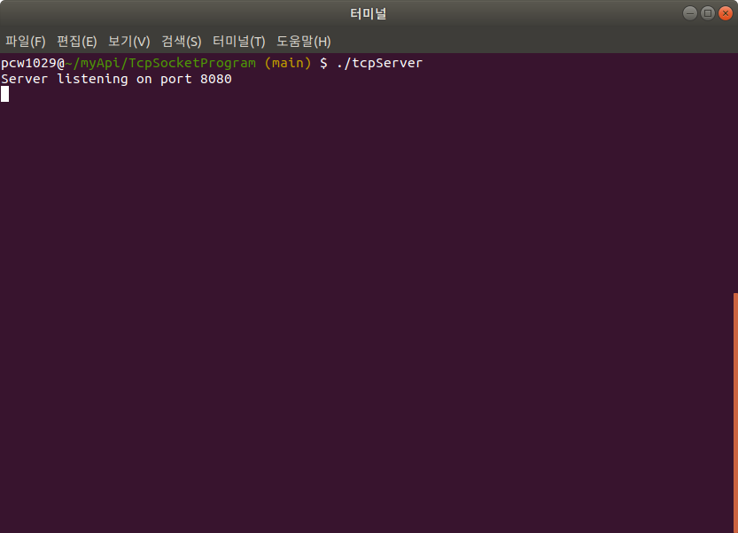
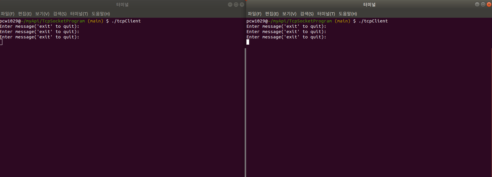
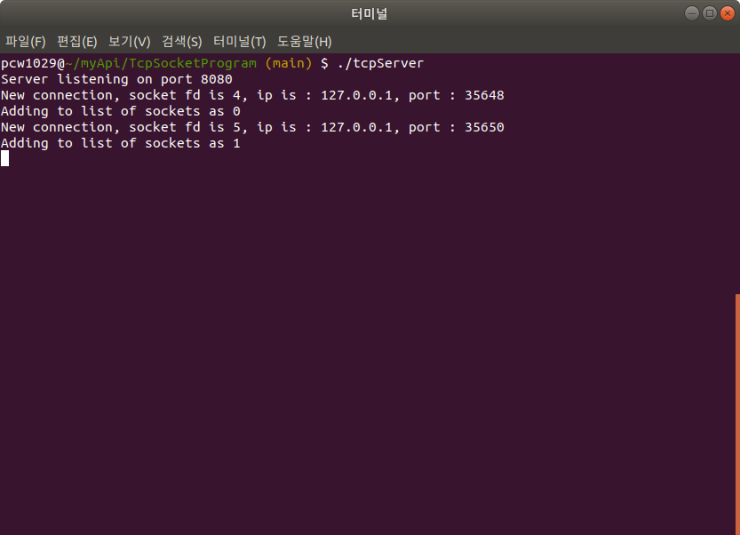
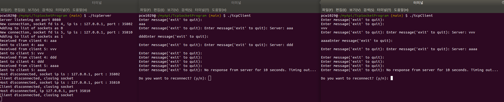

# TCP 서버 - 클라이언트 통신 프로그램
[TOC]

## 소개

이 프로젝트는 C언어로 구현된 TCP 서버-클라이언트 통신 프로그램입니다. 

서버는 다중 클라이언트를 동시에 처리할 수 있으며, 클라이언트는 서버와 상호 작용하며 데이터를 송수신 할 수 있습니다.


### 주요 구성 요소

* **서버** : 다중 클라이언트와 연결을 유지하며 데이터를 송수신합니다.

* **클라이언트** : 서버와 연결하여 메시지를 전송하거나 응답을 받을 수 있습니다.

본 프로그램은 `pthread`와 `select()`를 활용하여 멀티스레드 방식으로 구현되었습니다.


## 주요 기능

### 서버

- 여러 클라이언트와의 동시 연결 및 데이터 처리.

- 클라이언트마다 송수신 스레드 관리.

- 클라이언트 연결 및 해제

  

### 클라이언트

- 서버와의 연결 및 재연결 기능.

- 사용자 입력 메시지 전송 및 서버 응답 수신.

- 서버와의 연결 종료 및 타임아웃 처리.

  

## 구조


서버는 지정된 포트에서 클라이언트의 연결을 대기합니다.

클라이언트별로 송수신 스레드를 생성하여 비동기적으로 처리합니다.

데이터 송수신에 블로킹 I/O와 `select()`를 혼합하여 구현.


## 필수 구성 요소

* **운영체제**: 리눅스

* **컴파일러**: GCC 또는 Clang

* **필수 라이브러리**:

  - `pthread` (멀티스레드 구현용)

  - `sys/socket` (소켓 프로그래밍용)


## 설치 방법

1. 이 저장소를 클론합니다:

   ```bash
   git clone https://github.com/pcw1029/tcp-server-client.git
   cd tcp-server-client
   ```

   

2. 프로그램을 빌드합니다:

   ```bash
   make
   ```

   1. 단위테스트(google test)를 위한 빌드를 합니다. 이 빌드는 구글테스트를 위한 빌드입니다. 

      ```bash
      make gtest
      ```

      

3. 빌드 후 생성되는 실행 파일:

   1. `tcpServer`
   2. `tcpClient`

   

## 사용 방법

### 서버 실행:

1. 서버 프로그램 실행:

   ```bash
   ./tcpServer
   ```

2. 기본적으로 `8080번 포트`에서 클라이언트 연결을 대기합니다.

3. 연결 및 데이터 송수신 로그가 출력됩니다.

   

### 클라이언트 실행:

1. 클라이언트 프로그램 실행:

   ```bash
   ./tcpClient
   ```

2. 사용자 메시지를 입력합니다. `exit` 입력 시 클라이언트가 종료됩니다.

3. 서버가 종료되거나 응답하지 않을 경우, 클라이언트는 자동으로 연결을 종료하거나 재 접속 시도 여부를 묻습니다.


## 예제

### 서버 실행




### 클라이언트 실행




### 2개의 클라이언트가 접속했을때 서버 화면




### 메시지 전송 후 timeout에 의해 종료


